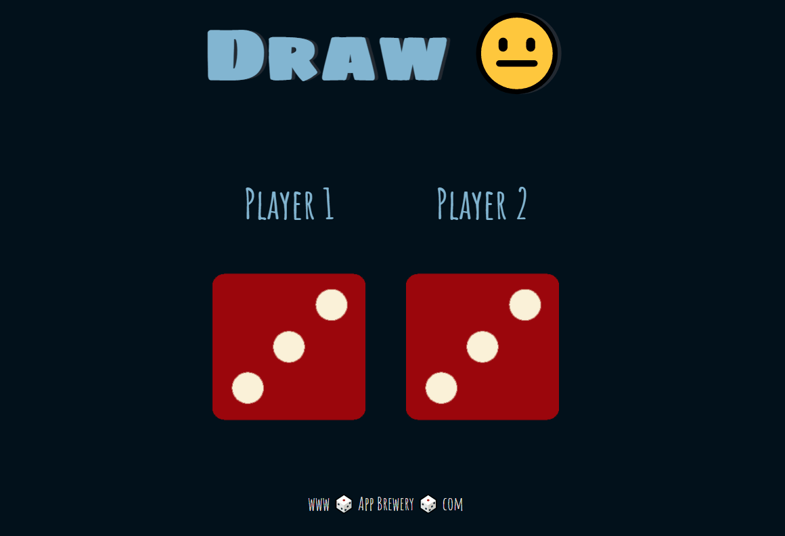

My second vanilla JavaScript challenge through Angela Yu's [web dev course](https://www.udemy.com/course/the-complete-web-development-bootcamp/) on Udemy.

The dice are "rolled" each time the page is refreshed. The heading updates to indicate which player has won (or if it was a draw).

Before adding my own customizations:

After customizing:

